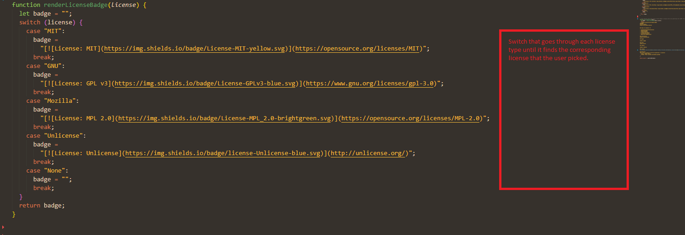

# Professional-README-Generator-Bryson Kern

## Description

For this project I created a ReadMe Generator that takes in responses and displays them on a formatted readMe file. My motivation for this assignment was to make creating readMe's fast and easy so that I could spend more time coding. While creating this project I learned more about switches and template literals.

## Table of Contents 🧙

- [installation](#installation)
- [Usage](#usage)
- [Tests](#Tests)
- [Creation](#Creation)
- [Credits](#credits)
- [License](#license)
- [Questions](#Questions)

## Installation

In order to use this readMe generator you first have to download the files from my gitHub Repository. Once you have the files stored on your local PC, you must open your command terminal and change into the correct directory. After you log into the correct directory you simply just type node index.js and then a prompt will appear that will walk you through creating your readMe.

## Usage

Using this project is very simple, all you have to do is go into the correct file directory in your command prompt and run node index.js.

## Tests

In order to assure my generator worked affectively I ran it multiple times with different parameters in order to solidify my rate of success.

## Creation

## Credits

For this project I used MDN (https://developer.mozilla.org/en-US/docs/Web/JavaScript/Reference/Template_literals), W3schols (https://www.w3schools.com/js/js_switch.asp), and Web Dev Simplified (https://www.youtube.com/watch?v=VShtPwEkDD0&ab_channel=WebDevSimplified).

## License

This project uses the MIT license.

## Questions

Feel free to contact me with any questions or concerns!

- email: kernbryson@yahoo.com
- GitHub: https://github.com/kernbryson
